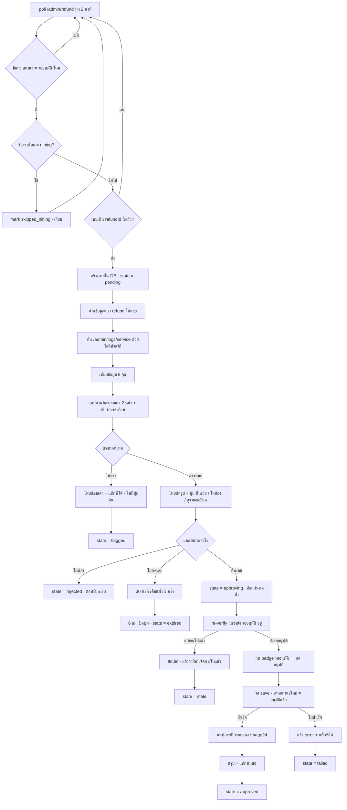

# ระบบคืนเครดิต Thunder (waan · thunder_refund)

เอกสารสเปกฉบับเต็ม — ใช้เป็นต้นทางทำ Flow File
สถานะ: **ออกแบบเสร็จ รอเริ่มพัฒนา** · ผู้ออกแบบร่วม: พี่โด้ + น้องวาน · วันที่ 17 ก.ค. 2026

---

## 1. เป้าหมาย

ทุกครั้งที่แอดมิน Thunder ยื่นคำร้อง "ขอคืนเครดิตบริการ" ให้ลูกค้า น้องวานต้อง:

1. **รู้เอง** ว่ามีคำขอใหม่เข้ามา (ไม่ต้องมีใครสั่ง)
2. **ตรวจเอง** ว่าคำขอนั้นข้อมูลตรงกับระบบหลังบ้านจริงทุกจุด
3. **ถามแอดมิน** ในกลุ่ม พร้อมสรุป + ภาพหลักฐาน + ปุ่มกด
4. **ลงมือคืนเอง** ในระบบหลังบ้านเมื่อแอดมินกดอนุมัติ
5. **รายงานกลับ** พร้อมภาพยืนยันว่าคืนสำเร็จ

เดิมงานนี้แอดมินต้องเปิดหลังบ้าน 2 หน้า ไล่เทียบเลขเอง แล้วกดอนุมัติเอง — วานรับไปทั้งหมด เหลือแค่ "กดปุ่มเดียว"

---

## 2. ตัวละคร / ระบบที่เกี่ยวข้อง

| ตัวละคร | คืออะไร | บทบาทในฟลว์ |
|---|---|---|
| **บอท Thunder Notify** | บอทของระบบ Thunder | ยิง noti `[#REQUEST_REFUND_SERVICE]` เข้ากลุ่ม Thunder Refund Notify เมื่อมีคำขอใหม่ |
| **กลุ่ม Thunder Refund Notify** | กลุ่ม Telegram (6 คน) | ต้นทาง noti — **ตัวเร่ง (optional)** ไม่ใช่แหล่งความจริง |
| **กลุ่ม "ขอคืนเครดิตไป - waan"** | กลุ่ม Telegram (4 คน, auto-delete 1 วัน) | ปลายทาง — วานโพสต์สรุป + ปุ่ม ที่นี่ |
| **หน้า `/admin/refund`** | หน้า "จัดการ ขอคืนเงิน" หลังบ้าน Thunder | **แหล่งความจริงหลัก** — ทั้งอ่านคำขอ และกดอนุมัติ |
| **หน้า `/admin/logs/service`** | หน้า "ประวัติ บริการ" หลังบ้าน Thunder | หน้ายืนยันข้าม — ค้นด้วย "ไอดีประวัติ" |
| **น้องวาน** | บอท Telegram + Playwright + DB | ตัวทำงานทั้งหมด |

---

## 3. การตัดสินใจสำคัญ (และเหตุผล)

### 3.1 ยึดหน้า `/admin/refund` เป็นจุดชนวน ไม่ใช่ข้อความบอท

**ปัญหา:** Telegram Bot API **ไม่ส่งข้อความที่บอทตัวอื่นพิมพ์**ให้บอทเรา (ข้อจำกัดระดับแพลตฟอร์ม) ถ้า Thunder Notify เป็น bot จริง วานจะไม่มีวันเห็นข้อความนั้น → trigger พังตั้งแต่ต้น

**ทางออกที่เลือก:** วาน **poll หน้า `/admin/refund` ทุก 2 นาที** หาแถวที่ `สถานะ = รออนุมัติ` เพราะข้อมูลครบอยู่บนหน้านั้นแล้วทุกช่อง

ผลพลอยได้:
- ไม่พลาดรายการแม้บอท Thunder ล่ม / ข้อความถูกลบ / กลุ่ม auto-delete
- **กันปลอม** — ถ้ายึดข้อความแชท ใครก็พิมพ์เลียนแบบเพื่อหลอกให้วานคืนเครดิตได้ แต่หน้าหลังบ้านปลอมไม่ได้
- ตรงนิยาม "รออนุมัติ = ยังไม่คืน" ที่พี่โด้ให้ไว้เป๊ะ

**ข้อความบอท = ตัวเร่ง (ถ้าอ่านได้)** ใช้ 2 อย่าง: (ก) เตือนทันทีไม่ต้องรอ poll (ข) เอา `บริการ #12550` + ชื่อร้าน มา cross-check เพิ่มอีกชั้น — ถ้าอ่านไม่ได้ ระบบทำงานได้ครบเหมือนเดิม

### 3.2 เลขที่ยึดเป็นกุญแจ = **ไอดีประวัติ** (175979)

บนหน้า refund คอลัมน์ "ประวัติบริการ" แสดง `#175979 | renew | ฿1,599.00`
เอา **175979** ไปกรอกช่อง **"ไอดีประวัติ"** ที่ `/admin/logs/service` → ได้แถวเดียว = รายการซื้อ/ต่ออายุครั้งนั้นจริง

> เลข `#12550` ที่บอทแจ้ง = **ไอดีบริการ** (ตัวร้าน) คนละตัวกับไอดีประวัติ (ตัวรายการ) — ไม่ปรากฏบนหน้า refund จึงเป็นแค่ข้อมูลเสริมจาก noti

### 3.3 กลุ่มปลายทาง = กลุ่ม dedicated

กลุ่ม "ขอคืนเครดิตไป - waan" ตั้งเป็น GroupFunc `thunder_refund` → วาน **ประมวลผลทุกข้อความโดยไม่ต้องแท็ก** (เหมือนกลุ่ม `thunder_expiry`) แต่ในทางปฏิบัติทีมแทบไม่ได้คุยกับวานที่นี่ — **แค่กดปุ่ม**

การผูกกลุ่ม: พี่โด้พิมพ์ในกลุ่มว่า "วานเชื่อมกลุ่มนี้ไว้คืนเครดิตหน่อย" → วานจับ intent → ตั้ง GroupFunc ให้เอง

### 3.4 กฎ nining

คำขอที่ **ร้องขอโดย `nining`** → **ข้ามเงียบ ไม่แจ้งเตือน ไม่ต้องตรวจ** (nining คือคนที่ดูแลเอง ไม่ต้องขออนุญาตใคร)
บันทึกลง DB เป็น `skipped_nining` เพื่อไม่ให้ poll หยิบซ้ำทุกรอบ

### 3.5 สิทธิ์การกดปุ่ม

**ทีมที่อนุญาต (canUseBot) กดได้ทุกคน** รวมคนที่ยื่นคำขอเอง (ไม่ล็อก 4-eyes) — ตามที่พี่โด้เลือก
บันทึกไว้เสมอว่า **ใครกด / เมื่อไหร่**

### 3.6 ตรวจไม่ผ่าน = ไม่มีปุ่ม

ถ้าเทียบข้อมูลแล้วมีจุดไม่ตรงแม้จุดเดียว → **ไม่แสดงปุ่ม "คืนเลย"** โพสต์ธงแดงบอกว่าไม่ตรงตรงไหน + แท็กพี่โด้ ให้คนตัดสินใจเอง
ไม่มีปุ่ม force — ถ้าจะฝืนคืน ต้องไปกดในระบบเอง

---

## 4. ฟลว์หลัก (ภาพรวม)



---

## 5. ฟลว์ละเอียด ทีละขั้น

### ขั้น 1 — เฝ้า (poll)

- **ความถี่:** ทุก 2 นาที (ปรับได้ผ่าน env `REFUND_POLL_MS`)
- **ที่มา:** `scripts/refund-watch.mjs` รันเป็น LaunchAgent (เหมือน drive-watch)
- **ทำอะไร:** เปิด Playwright ด้วย `.thunder-session.json` → เข้า `/admin/refund` → อ่านตารางหน้าแรก (10 แถวล่าสุด เรียงตาม ID ลดหลั่น)
- **กรอง:** เก็บเฉพาะแถว `สถานะ = รออนุมัติ`
- **ทางลัด:** ถ้ารอบนี้ไม่มีแถวรออนุมัติเลย → ปิด browser จบรอบ (ไม่แตะหน้า logs)

**ข้อควรระวังที่รู้มาแล้วจาก thunder_expiry:**
- ห้ามใช้ `.fill()` กับช่องค้นหา SPA เด็ดขาด → ใช้ `click()` + `pressSequentially()`
- ต้องรอ "มีข้อมูล N รายการ" ที่ **N ไม่ใช่ 0** (การพิมพ์รีเซ็ต count เป็น 0 ทันที)
- session อายุ ~1–1.5 ชม. → เจอ session หมด ต้องแจ้งให้รัน `npm run thunder:auth` ไม่ใช่เงียบ
- อย่ายิงถี่เกิน — Thunder rate-limit ที่ ~15 ครั้ง/ชม. แล้วคืนผลมั่ว (2 นาที/ครั้ง = 30 ครั้ง/ชม. **ต้องทดสอบว่าโดน limit ไหม ถ้าโดนขยับเป็น 5 นาที**)

### ขั้น 2 — คัดกรอง

| เงื่อนไข | ผล |
|---|---|
| ร้องขอโดย = `nining` | ข้ามเงียบ · `skipped_nining` |
| refundId เคยอยู่ใน DB แล้ว | ข้าม (กันแจ้งซ้ำทุก 2 นาที) |
| นอกนั้น | สร้างเคสใหม่ `pending` |

### ขั้น 3 — เก็บข้อมูลจากหน้า refund

อ่านจากแถวนั้นให้ครบ:

| ฟิลด์ | ตัวอย่าง | หมายเหตุ |
|---|---|---|
| ID คำขอ | `2677` | คีย์หลักของเคส |
| ผู้ใช้ | `siwaul` | เจ้าของบริการที่จะได้เครดิตคืน |
| ร้องขอโดย | `kornalone1` | แอดมินที่ยื่นคำร้อง = คนที่ต้องแท็กตอนจบ |
| ประวัติบริการ | `#175979 \| renew \| ฿1,599.00` | แตกเป็น 3 ค่า: historyId / type / priceInLink |
| จำนวน | `฿1,599.00` | ยอดที่ขอคืน |
| หมายเหตุ | `ต่ออายุผิด` | เหตุผล |
| สร้างเมื่อ | `16 ก.ค. 2026, 19:15` | เวลายื่นคำร้อง |
| สถานะ | `รออนุมัติ` | ต้องเป็นค่านี้เท่านั้น |

### ขั้น 4 — ยืนยันข้ามที่หน้าประวัติบริการ

1. เข้า `/admin/logs/service`
2. กรอก **175979** ลงช่อง **"ไอดีประวัติ"** (pressSequentially)
3. กด "ค้นหา" → รอ "มีข้อมูล 1 รายการ"
4. อ่านแถวผลลัพธ์:

| ฟิลด์ | ตัวอย่าง |
|---|---|
| ID | `175979` |
| USERNAME | `siwaul` |
| ชื่อจริง / นามสกุล | `ศิวกร / เอื้อมสราญวรกุล` |
| ชื่อร้านค้า | `โรงงานลูกชิ้นยายทอง` |
| ประเภท | `RENEW` |
| แพ็กเกจ | `Verify Slip Gold` |
| ราคา (บาท) | `+฿1,599` |
| ระยะเวลาต่ออายุ | `1 เดือน` |
| วันที่ซื้อ | `16 ก.ค. 2026, 19:05` |

**ผลที่รับไม่ได้:** ได้ 0 แถว หรือ >1 แถว → ธงแดงทันที (ผิดปกติร้ายแรง)

### ขั้น 5 — เมทริกซ์เทียบข้อมูล (8 จุด)

| # | จุดตรวจ | หน้า refund | หน้า logs/service | noti (ถ้ามี) | ระดับ |
|---|---|---|---|---|---|
| 1 | ไอดีประวัติ | `#175979` | `ID 175979` | — | **บังคับ** |
| 2 | ยูสเซอร์ | `siwaul` | `USERNAME siwaul` | — | **บังคับ** |
| 3 | ยอดเงิน | `฿1,599.00` | `+฿1,599` | `1,599฿` | **บังคับ** |
| 4 | ยอดในลิงก์ประวัติ | `฿1,599.00` | — | — | **บังคับ** (ต้องเท่าคอลัมน์จำนวน) |
| 5 | สถานะ | `รออนุมัติ` | — | — | **บังคับ** |
| 6 | ชื่อร้านค้า | — | `โรงงานลูกชิ้นยายทอง` | ชื่อร้านใน noti | **บังคับถ้ามี noti** |
| 7 | ประเภท vs เหตุผล | `ต่ออายุผิด` | `RENEW` | — | เตือน (soft) |
| 8 | ไอดีบริการปิดลูป | — | ค้นด้วย `ไอดีบริการ = 12550` ต้องเจอ log 175979 | `#12550` | เตือน (soft) — ทำได้เมื่อมี noti |

**บังคับไม่ผ่านแม้ข้อเดียว → ไม่มีปุ่มคืน**
**soft ไม่ผ่าน → ยังมีปุ่ม แต่ติดธงเหลืองเตือนในการ์ด**

การเทียบตัวเลข: ตัด `฿` `,` `+` ช่องว่าง แล้วเทียบเป็น number (`1599 === 1599`)
การเทียบชื่อร้าน: trim + ตัดช่องว่างซ้ำ + เทียบตรงตัว (ถ้าไม่ตรงเป๊ะ → เทียบแบบ contains ก่อนตัดสินว่าไม่ตรง)

### ขั้น 6 — ภาพหลักฐาน (3 ใบ)

| ใบ | เนื้อหา | วิธีทำ |
|---|---|---|
| 1 | แถวในหน้า refund ตีกรอบแดง | reuse เทคนิค `shotRowsTwoParts` — `boxShadow: inset` สีแดง `#e11d1d` ทุก `td` ของแถวเป้าหมาย แล้ว `page.screenshot({clip})` เฉพาะ thead + แถวนั้น (ตารางนี้ไม่กว้างเกินจอ → **ใบเดียวพอ ไม่ต้องแบ่งซ้าย/ขวา**) |
| 2 | แถวในหน้า logs/service ตีกรอบแดง | เหมือนกัน (ตารางนี้กว้าง → อาจต้องแบ่ง 2 ฝั่ง หรือ clip เฉพาะคอลัมน์ ID→ราคา) |
| 3 | การ์ดเทียบข้อมูล | HTML → PNG ผ่าน `renderHtmlToPng` สไตล์เดียวกับการ์ด AFF (หัวการ์ด + badge "พร้อมอนุมัติ" / "พบข้อผิดพลาด" + ตาราง 3 คอลัมน์ + badge ตรง/ไม่ตรงรายบรรทัด) |

**ภาพหลังคืนสำเร็จ (ใบที่ 4):** สัดส่วนตาม Image 24 — เห็น "มีข้อมูล N รายการ" + dropdown 10 + ทั้งตาราง 10 แถว โดยแถวเป้าหมาย (2677) ตีกรอบแดง และสถานะเปลี่ยนเป็น `อนุมัติแล้ว` แล้ว

### ขั้น 7 — ข้อความแจ้งเตือนในกลุ่ม

**กรณีตรวจผ่าน:**

```
📤 คำขอคืนเครดิตบริการ

ผู้ขอ  kornalone1 (ผู้ดูแล #591)
ยูสเซอร์  siwaul · โรงงานลูกชิ้นยายทอง
ประวัติบริการ  #175979 · RENEW · Verify Slip Gold
ยอด  ฿1,599.00
เหตุผล  ต่ออายุผิด
เวลา  16 ก.ค. 2026 19:15 · คำขอ #2677

วานตรวจแล้ว 8/8 จุด ตรงกันทั้งหมด ✅

คืนเครดิตให้เลยไหมคะ

[ ✅ คืนเลย ]  [ ❌ ไม่ต้อง ]  [ 🔎 ดูรายละเอียด ]
```

**กรณีตรวจไม่ผ่าน:**

```
⚠️ คำขอคืนเครดิตนี้ข้อมูลไม่ตรง — ยังไม่คืนให้นะคะ

ผู้ขอ  kornalone1 · คำขอ #2677
ยูสเซอร์  siwaul · ยอด ฿1,599.00

จุดที่ไม่ตรง:
• ยอดเงิน — หน้าคืนเงิน ฿1,599.00 แต่ประวัติบริการ ฿199.00

@โด้ รบกวนดูให้หน่อยค่ะ วานไม่กล้าคืนเอง
```

**หลังคืนสำเร็จ:**

```
✅ คืนเครดิตเรียบร้อยแล้วค่ะ

คำขอ #2677 · siwaul · โรงงานลูกชิ้นยายทอง
ยอด ฿1,599.00 · เหตุผล ต่ออายุผิด
สถานะในระบบ: รออนุมัติ → อนุมัติแล้ว
อนุมัติโดย <คนที่กดปุ่ม> · 17 ก.ค. 2026 13:40

@kornalone1 คืนเครดิตให้เรียบร้อยแล้วนะคะ
[ภาพยืนยันตีกรอบแดง]
```

**ปุ่ม "🔎 ดูรายละเอียด"** → ส่งการ์ดเทียบ + ภาพหลักฐาน 2 ใบ (กันแชทรก คนอยากดูค่อยกด)

### ขั้น 8 — ลงมือคืน (write path)

1. รับ callback `tref:ok:<refundId>` → ตอบ callback ทันที "กำลังคืนให้ค่ะ รอสักครู่..."
2. ปิดปุ่มทันที (`editMessageReplyMarkup` เป็น `[]`) — กันกดซ้ำ
3. เปลี่ยน state → `approving` (ล็อกใน DB, ถ้ามีคนกดซ้อนจะเจอ state ไม่ใช่ pending แล้วหยุด)
4. เปิด Playwright → `/admin/refund` → ค้นด้วยช่อง "ไอดี" = 2677 (หรือหาแถวในหน้าแรก)
5. **re-verify:** สถานะยังเป็น `รออนุมัติ` + ผู้ใช้/ยอดยังตรงกับตอนแจ้ง → ถ้าไม่ตรง = มีคนจัดการไปแล้ว → หยุด แจ้ง `stale`
6. คลิก badge `รออนุมัติ` ที่คอลัมน์สถานะ → popup `จัดการ #2677` โผล่ (มี `✅ อนุมัติ` / `❌ ปฏิเสธ (!)`)
7. คลิก `อนุมัติ`
8. รอ save → อ่านสถานะแถวนั้นใหม่ ต้องเป็น `อนุมัติแล้ว` (ยืนยันว่าสำเร็จจริง ไม่เชื่อแค่คลิกติด)
9. ตีกรอบแดง + แคปภาพ Image24 → โพสต์สรุป + แท็ก `kornalone1`
10. `logActivity()` + state `approved`

### ขั้น 9 — เคสขอบ

| เคส | ทำอะไร |
|---|---|
| session หมด | แจ้งกลุ่ม "session Thunder หมดอายุ รบกวนพี่โด้รัน `npm run thunder:auth`" (แจ้งครั้งเดียว ไม่สแปมทุก 2 นาที) |
| ค้นแล้วได้ 0 แถว | retry 1 ครั้ง (รู้จากประสบการณ์ backend ช้า) แล้วค่อยธงแดง |
| หน้า logs ได้ >1 แถว | ธงแดง (ไอดีประวัติต้อง unique) |
| มีคนกดปุ่มพร้อมกัน | DB state machine กัน — คนที่สองเจอ state `approving` → ตอบ "มีคนกดไปแล้วค่ะ" |
| บอทรีสตาร์ทกลางคัน state ค้าง `approving` | เกิน 10 นาที → re-check สถานะจริงในระบบ แล้ว reconcile |
| แอดมินไม่กดเลย | 30 นาที เตือนซ้ำ 1 ครั้ง · 6 ชม. ปิดปุ่ม state `expired` |
| กลุ่ม auto-delete 1 วัน | ข้อความหาย แต่ DB + dashboard เก็บครบ ตรวจย้อนหลังได้ |
| คำขอถูกปฏิเสธในระบบก่อนวานถาม | poll เห็นสถานะไม่ใช่ "รออนุมัติ" ก็ไม่หยิบมาตั้งแต่แรก |

---

## 6. โครงสร้างข้อมูล

### Prisma model ใหม่

```prisma
model RefundCase {
  id            String   @id @default(cuid())
  refundId      String   @unique   // 2677 — คีย์กันซ้ำ
  historyId     String              // 175979
  serviceId     String?             // 12550 (ถ้ามี noti)
  username      String              // siwaul
  requestedBy   String              // kornalone1
  shopName      String?             // โรงงานลูกชิ้นยายทอง
  amount        Float               // 1599
  reason        String              // ต่ออายุผิด
  serviceType   String?             // RENEW
  packageName   String?             // Verify Slip Gold
  requestedAt   DateTime            // 16 ก.ค. 2026 19:15

  state         String   @default("pending")
  // pending | notified | approving | approved | rejected | flagged | stale | failed | expired | skipped_nining

  checks        String?             // JSON ผลตรวจ 8 จุด
  allOk         Boolean  @default(false)
  mismatches    String?             // JSON จุดที่ไม่ตรง

  chatId        String?
  messageId     String?             // ข้อความที่มีปุ่ม (ไว้ปิดปุ่ม/แก้)
  decidedBy     String?             // ชื่อคนกด
  decidedById   String?             // telegram id
  decidedAt     DateTime?
  error         String?

  createdAt     DateTime @default(now())
  updatedAt     DateTime @updatedAt
}
```

### State machine

```
                    ┌─→ skipped_nining (จบ)
poll เจอแถว ───────┤
                    └─→ pending ─→ [ตรวจ] ─┬─→ flagged (จบ · ธงแดง)
                                            └─→ notified ─┬─→ rejected (จบ)
                                                          ├─→ expired (จบ)
                                                          └─→ approving ─┬─→ approved (จบ)
                                                                          ├─→ stale (จบ)
                                                                          └─→ failed (จบ)
```

---

## 7. ไฟล์ที่ต้องสร้าง / แก้

### สร้างใหม่

| ไฟล์ | หน้าที่ |
|---|---|
| `src/lib/thunder-refund.ts` | Playwright ทั้งหมด: `listPendingRefunds()` · `fetchRefundRow(id)` · `fetchServiceLog(historyId)` · `approveRefund(id)` · `shotRefundRow()` |
| `src/lib/refund-check.ts` | เมทริกซ์ตรวจ 8 จุด + สร้าง HTML การ์ดเทียบ |
| `src/lib/refund-store.ts` | อ่าน/เขียน RefundCase + state machine + lock |
| `src/lib/refund-notify.ts` | parse ข้อความบอท `[#REQUEST_REFUND_SERVICE]` (ตัวเร่ง) |
| `scripts/refund-watch.mjs` | poller (LaunchAgent) |
| `src/app/api/telegram/refund-poll/route.ts` | endpoint ที่ poller ยิงมา → ทำงานทั้งฟลว์ |
| `src/app/api/telegram/refund-notify/route.ts` | รับข้อความ noti จากบอท (ถ้าอ่านได้) |

### แก้ของเดิม

| ไฟล์ | แก้อะไร |
|---|---|
| `src/lib/roles.ts` | เพิ่ม GroupFunc `thunder_refund` |
| `src/app/api/telegram/dedicated-groups/route.ts` | **สำคัญ** — ต้องคืนกลุ่ม `thunder_refund` ด้วย ไม่งั้นวานไม่ตอบในกลุ่ม |
| `src/app/api/telegram/callback/route.ts` | รับ `tref:ok` / `tref:no` / `tref:detail` |
| `scripts/telegram-bot.mjs` | branch callback `tref:` (ส่ง fromId + fromName) |
| `prisma/schema.prisma` | model RefundCase (`npm run db:push` แล้ว **restart web**) |
| `package.json` | script `refund:watch` |

---

## 8. ไอเดียเสริม (เฟส 3)

| ไอเดีย | รายละเอียด |
|---|---|
| **Anti-fraud flag** | ธงเหลืองในการ์ดเมื่อ: แอดมินคนเดิมขอคืนให้ user เดิมซ้ำในสัปดาห์เดียว · ยอดสูงผิดปกติ · คืนบริการที่ซื้อไปนานแล้ว (16 ก.ค. 19:05 ซื้อ → 19:15 ขอคืน = ปกติ / ห่าง 2 เดือน = ผิดปกติ) |
| **สรุปรายสัปดาห์** | โพสต์ในกลุ่ม: กี่รายการ · ยอดรวม · ใครขอเยอะสุด · เฉลี่ยกี่นาทีกว่าจะอนุมัติ |
| **หน้า dashboard** | หน้าเว็บดูเคสย้อนหลัง (กลุ่ม auto-delete 1 วัน แต่ DB อยู่ครบ) |
| **แท็กตามกะ** | reuse `oho-shifts.mjs` แท็กแอดมินที่เข้าเวรตอนนั้นแทนแท็กทุกคน |
| **respect mute** | เคารพ `mute.ts` ถ้าพี่โด้สั่งปิดแจ้งเตือนกลุ่มนี้ |

---

## 9. แผนพัฒนา 3 เฟส

| เฟส | ขอบเขต | เกณฑ์ผ่าน |
|---|---|---|
| **1 · read-only** | poll + ตรวจ 8 จุด + การ์ด + ภาพ + ปุ่ม (ปุ่มยังไม่ต่อ execute) | เห็นคำขอจริงในกลุ่ม ข้อมูลตรงกับที่พี่โด้เปิดดูเอง 100% |
| **2 · write** | ต่อปุ่มอนุมัติจริง + re-verify + ภาพ Image24 + แท็กคนขอ | คืนเครดิตรายการจริงรายการแรกสำเร็จ (ทำพร้อมพี่โด้ดูอยู่) |
| **3 · polish** | anti-fraud · สรุปรายสัปดาห์ · dashboard · แท็กตามกะ | — |

> เหมือน thunder_expiry: **write path จะถูกทดสอบจริงครั้งแรกตอนแอดมินกดปุ่ม** — ห้ามทดสอบกดอนุมัติมั่วกับรายการลูกค้าจริง

---

## 10. ความเสี่ยงที่รู้ล่วงหน้า

| ความเสี่ยง | ผลถ้าเกิด | กันยังไง |
|---|---|---|
| Telegram ไม่ให้บอทอ่านข้อความบอท | trigger จาก noti พัง | **ไม่พึ่ง noti ตั้งแต่แรก** — poll หน้า refund เป็นหลัก |
| Thunder rate-limit | poll คืน "0 รายการ" มั่ว → พลาดคำขอ | เริ่มที่ 2 นาที วัดจริง ถ้าโดนขยับเป็น 5 นาที + retry |
| session หมดทุก ~1.5 ชม. | poll ตายเงียบ | ตรวจ session ทุกรอบ + แจ้งกลุ่มครั้งเดียวเมื่อหมด |
| กดอนุมัติผิดแถว | **คืนเงินผิดคน — ร้ายแรงที่สุด** | ค้นด้วยไอดีคำขอเจาะจง + re-verify ยูสเซอร์/ยอด/สถานะ ก่อนคลิก + ยืนยันสถานะหลังคลิก |
| คลิกติดแต่ระบบไม่ได้ save | รายงานว่าสำเร็จทั้งที่ไม่สำเร็จ | อ่านสถานะซ้ำหลัง save ต้องเป็น "อนุมัติแล้ว" เท่านั้นถึงรายงานสำเร็จ |
| poll ชนกับ execute (browser ซ้อน) | Chromium เปิดซ้อน กินแรม | single-flight mutex |

---

## 11. คำถามที่ตอบแล้ว

| คำถาม | คำตอบของพี่โด้ |
|---|---|
| จุดชนวน | poll หน้า refund เป็นหลัก + noti เป็นตัวเร่ง |
| ใครกดปุ่มได้ | ทีมที่อนุญาตทุกคน (ไม่ล็อก 4-eyes) |
| ตรวจไม่ผ่านทำไง | ไม่มีปุ่มคืน + ธงแดง + แท็กพี่โด้ |
| เลขไหนเป็นกุญแจ | **ไอดีประวัติ** (175979) → ค้นช่อง "ไอดีประวัติ" ที่ `/admin/logs/service` |
| กลุ่มปลายทาง | พี่โด้จะพิมพ์ผูกกลุ่มเองตอนเริ่มทำจริง · กลุ่มนี้วานตอบทุกคนโดยไม่ต้องแท็ก · ทีมแค่กดปุ่ม |
| รายการชนกันไหม | แทบไม่มี (เคสต่อเคส) · nining = ไม่ต้องแจ้ง |
